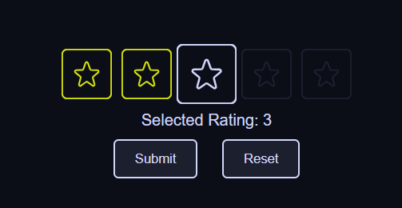
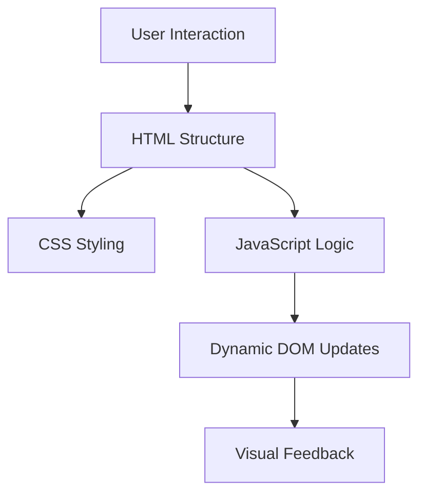

# Rating App

---

[Rating ⭐](https://axlgoze.github.io/Rating/)



A simple and interactive rating component built with HTML, CSS, and JavaScript. This project allows users to visually select a rating from a predefined range, with a space-themed aesthetic. It demonstrates dynamic DOM manipulation and responsive design principles.

**Tech Stack:**
- **Languages:** HTML, CSS, JavaScript
- **Tools/Frameworks:** None

---

## Visual Flow Map (Architecture)



---

## Core Components

| File/Class       | Primary Responsibility         | Key Inputs/Outputs            |
|------------------|--------------------------------|--------------------------------|
| **index.html**   | Base structure of the app      | Inputs: None                  |
|                  |                                | Outputs: DOM elements         |
| **main.css**     | Styling and layout             | Inputs: None                  |
|                  |                                | Outputs: Visual presentation  |
| **main.js**      | Dynamic rating functionality   | Inputs: User clicks           |
|                  |                                | Outputs: DOM updates          |

---

## Installation & Usage

### Installation
```bash
# Clone the repository
$ git clone <repository-url>

# Navigate to the project directory
$ cd RaitingComponent
```

### Usage
Simply open the `index.html` file in your browser to view and interact with the rating component.

---

### Design
- Separation of Concerns: HTML, CSS, and JavaScript are modularized.
- Accessibility: Hover effects and clear visual feedback.
- Minimal Dependencies: No external libraries or frameworks.

### Roadmap
- [ ] Add accessibility features for keyboard navigation.
- [ ] Integrate with a backend to store ratings.

---

## Contribution & Testing

### How to Contribute
- Ensure code readability and maintain clean, modular code.
- Follow the existing coding style and structure.
- Submit pull requests with clear descriptions of changes.

### Testing
- Manual Testing: Interact with the component in the browser to ensure functionality.
- Automated Testing: Add unit tests for JavaScript logic (future improvement).

---

### About me
[linkedin](https://www.linkedin.com/in/axel-reyes-wd/)

---